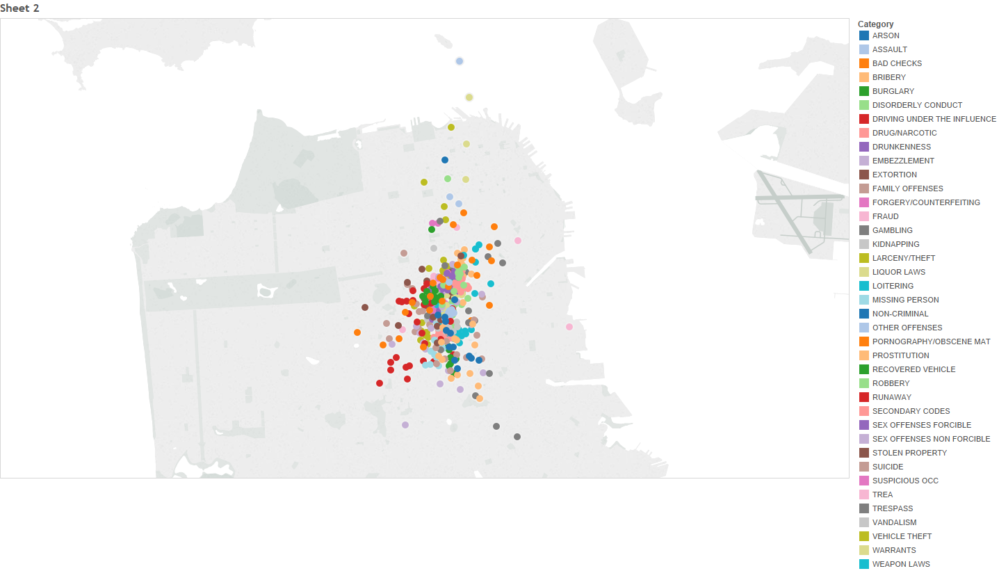

# kaggle_SFCrime
 

This repository is created for the Kaggle SF crime prediction project. In the file name <i>SF crime(1).ipynb</i>, Bernoulli Naive Bayes method was used as the predictive model, and 
in <i>SF crime(2).ipynb</i>, XGB classifier was used and yielded better results. For both methods, weekeday was extracted from Dates column, and one-hot-encoding was performed for the categorical columns. Features used for modeling were the same for both models - mainly the neighborhoods, gps coordinate (Y), and time. For the XGB classifier, a feature importance graph was generated as part of the XGB library. Feature importance score (F score on x-axis) is a measure of how useful a feature when it comes to improving decision tree performance within the Ensemble model. Based on this graph, the GPS location, hours (second highest), and certain months (June, October) yielded strong predictive powers in determining the probability of a crime category.

.png)

 Using Tableau, a map of the crime activity is generated as shown (for interactive map, click <a href="https://public.tableau.com/shared/F3RWWW3FS?:display_count=yes"> here </a>).

  

